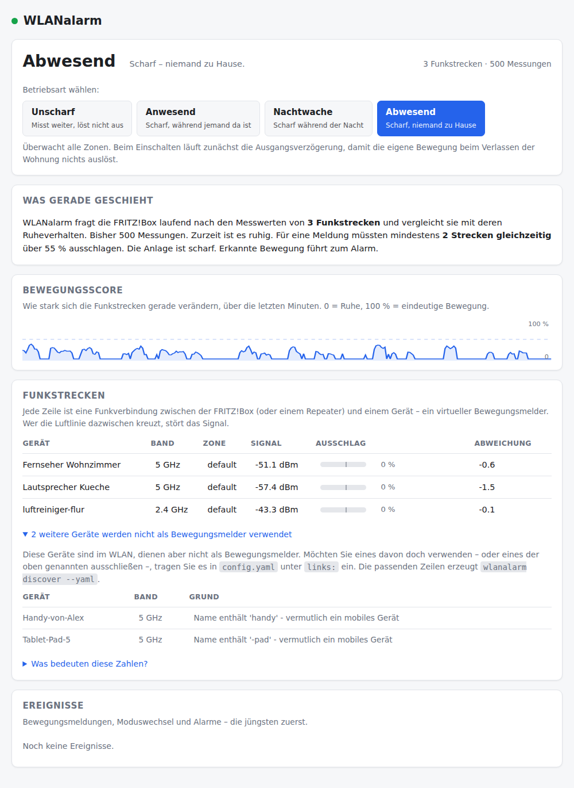

# WLANalarm unter Windows 11 einrichten

Diese Anleitung führt vollständig von null bis zur laufenden Anlage. Sie
brauchen keine Vorkenntnisse in Git oder Python. Alle Befehle sind für
**PowerShell** – nicht für die alte Eingabeaufforderung.

Planen Sie etwa 20 Minuten ein, plus 15 Minuten Kalibrierung, während der Sie
die Wohnung verlassen.

**Die Schritte in der richtigen Reihenfolge:**

| | Schritt | Dauer |
|---|---|---|
| 1 | Git und Python installieren | 5 min |
| 2 | FRITZ!Box vorbereiten | 5 min |
| 3 | WLANalarm installieren | 3 min |
| 4 | Zugangsdaten eintragen | 2 min |
| 5 | Verbindung prüfen | 1 min |
| 6 | Sensoren aussuchen | 2 min |
| 7 | Kalibrieren (Wohnung verlassen) | 15 min |
| 8 | Starten | 1 min |
| 9 | Meldungen aufs Handy einrichten | 5 min |
| 10 | Autostart einrichten (optional) | 2 min |

---

## Bevor Sie anfangen: drei Voraussetzungen

Prüfen Sie diese drei Punkte, bevor Sie Zeit investieren. Fehlt einer, kann die
Anlage nicht zuverlässig arbeiten.

**1. Der PC muss durchlaufen und darf nicht in den Energiesparmodus wechseln.**
Ein Windows-PC schläft nach 15 bis 30 Minuten ein. Genau dann – nachts und bei
Abwesenheit – würde die Überwachung aussetzen, ohne dass Sie es merken.

> *Einstellungen* → *System* → *Netzbetrieb und Energiesparen* →
> *Bildschirm und Energiesparmodus* → **„Bei Netzbetrieb Gerät in den
> Energiesparmodus versetzen nach: Nie"**

Der Bildschirm darf ausgehen, der Rechner nicht. Wer den PC nachts ausschaltet,
sollte WLANalarm stattdessen auf einem Kleinstrechner betreiben, der ohnehin
durchläuft.

**2. Ihre FRITZ!Box braucht FRITZ!OS 7 oder neuer.**
Zu sehen unter <http://fritz.box> in der Kopfzeile der Oberfläche. Ältere
Versionen liefern die benötigte Mesh-Übersicht nicht.

**3. Sie brauchen mindestens zwei ortsfeste Geräte, die häufig funken.**
Das ist die schärfste Bedingung, und sie überrascht die meisten. Die FRITZ!Box
erneuert den Messwert einer Verbindung nur, wenn dort auch Daten fließen.

| Geeignet | Ungeeignet |
|---|---|
| Fernseher, **solange eingeschaltet** | Geräte im Stromsparmodus |
| Lautsprecher mit laufender Wiedergabe | Drucker im Ruhezustand |
| Überwachungskamera mit Videostrom | Smartphones, Tablets, Notebooks |
| Repeater mit **WLAN**-Anbindung | Geräte, die nachts ausgehen |

Eine smarte Steckdose oder ein Sensor sendet oft nur alle ein bis zwei Minuten
ein Lebenszeichen. Dazwischen liefert die Box unverändert denselben Wert – für
eine Bewegungserkennung ist das zu selten. Ob Ihre Geräte ausreichen, zeigt
Schritt 7.

## PowerShell öffnen

Sie brauchen sie zweimal in unterschiedlicher Form:

* **Normal** für Schritte 1 und 3–8:
  Windows-Taste drücken, `powershell` tippen, Enter.
* **Als Administrator** nur für Schritt 10:
  Windows-Taste, `powershell` tippen, dann Rechtsklick auf „Windows PowerShell"
  → *Als Administrator ausführen*.

Verweigert PowerShell später die Ausführung von Skripten, hilft dieser Befehl
einmalig (er gilt nur für Ihren Benutzer und ist ungefährlich):

```powershell
Set-ExecutionPolicy -Scope CurrentUser RemoteSigned
```

---

## Schritt 1: Git und Python installieren

Beides kommt über `winget`, das Windows 11 mitbringt:

```powershell
winget install --id Git.Git
winget install --id Python.Python.3.12
```

> **Danach das PowerShell-Fenster schließen und ein neues öffnen.**
> Erst dann kennt Windows die neuen Befehle. Diesen Punkt übersehen die
> meisten, und dann meldet der nächste Schritt „Git fehlt".

Prüfen, ob es geklappt hat:

```powershell
git --version
py --version
```

Beide müssen eine Versionsnummer ausgeben. Bei Python muss sie **3.11 oder
höher** lauten.

---

## Schritt 2: FRITZ!Box vorbereiten

Zwei Einstellungen in der FRITZ!Box-Oberfläche (<http://fritz.box> im Browser).

**a) Einen Benutzer für WLANalarm anlegen**

> *System* → *FRITZ!Box-Benutzer* → *Benutzer hinzufügen*

| Feld | Wert |
|---|---|
| Benutzername | `wlanalarm` |
| Kennwort | ein eigenes, langes Kennwort – **notieren Sie es**, Sie brauchen es in Schritt 4 |
| Zugang aus dem Internet erlaubt | **aus** |
| FRITZ!Box Einstellungen | **an** ← zwingend |
| alles Übrige | aus |

Warum ein eigener Benutzer und nicht Ihr normales Kennwort: Das Kennwort liegt
danach im Klartext auf Ihrem PC. Geht der PC verloren, sperren Sie diesen einen
Benutzer und sind fertig.

**b) Den Zugriff für Programme freischalten**

> *Heimnetz* → *Netzwerk* → Reiter *Netzwerkeinstellungen*
> → Haken bei **„Zugriff für Anwendungen zulassen"**

Ohne diesen Haken antwortet die FRITZ!Box gar nicht.

---

## Schritt 3: WLANalarm installieren

Ein Befehlspaar, in einer **normalen** PowerShell:

```powershell
irm https://raw.githubusercontent.com/ullrichc/WLANalarm/main/deploy/setup-windows.ps1 -OutFile setup-wlanalarm.ps1
.\setup-wlanalarm.ps1
```

Das Skript legt alles unter `C:\Code\WLAN` an: Es holt das Projekt, richtet die
Python-Umgebung ein, installiert die benötigten Programmbibliotheken und führt
zur Kontrolle die Testsuite aus. Am Ende steht „Fertig."

Die heruntergeladene Datei und das Projektverzeichnis liegen in dem Ordner, in
dem Sie PowerShell geöffnet haben – standardmäßig `C:\Users\IhrName`. Das
Projekt selbst landet unabhängig davon unter `C:\Code\WLAN`.

Möchten Sie ein anderes Verzeichnis:

```powershell
.\setup-wlanalarm.ps1 -Zielpfad D:\Projekte\WLANalarm
```

Ab hier arbeiten Sie in diesem Verzeichnis. Öffnen Sie es und schalten Sie die
Python-Umgebung ein:

```powershell
cd C:\Code\WLAN
.\venv\Scripts\Activate.ps1
```

> Vor der Eingabezeile steht danach `(venv)`. **Das muss bei allen folgenden
> Befehlen so sein.** Nach jedem neuen PowerShell-Fenster diese zwei Zeilen
> wiederholen.

---

## Schritt 4: Zugangsdaten eintragen

**a) Benutzernamen in die Konfiguration schreiben**

```powershell
notepad config.yaml
```

Suchen Sie den Abschnitt `fritzbox:` und tragen Sie den Benutzernamen aus
Schritt 2 ein:

```yaml
fritzbox:
  address: "http://fritz.box"
  username: "wlanalarm"
  password: "${env:FRITZ_PASSWORD}"
```

Die Zeile mit `password` **bleibt genau so stehen** – das Kennwort selbst kommt
nicht in die Datei. Speichern und Notepad schließen.

**b) Kennwort hinterlegen**

```powershell
$env:FRITZ_PASSWORD = 'IhrKennwortAusSchritt2'
```

> Das gilt nur für das aktuelle PowerShell-Fenster. Nach dem Schließen ist es
> weg, und der nächste Befehl meldet einen Anmeldefehler.

Dauerhaft für Ihren Benutzer hinterlegen – dann entfällt das jedes Mal:

```powershell
[Environment]::SetEnvironmentVariable('FRITZ_PASSWORD', 'IhrKennwort', 'User')
```

Danach einmal PowerShell neu öffnen (und `cd` plus `Activate.ps1` wiederholen).

---

## Schritt 5: Verbindung prüfen

```powershell
wlanalarm check
```

Erwartete Ausgabe:

```
Konfiguration config.yaml: in Ordnung
  Takt        : 2.0 s
  Fenster     : 12.0 s
  Baseline    : 15 min 0 s
  Kanäle      : nur Log
  Bänder      : alle
  min_links   : 2
  FRITZ!Box   : mesh (FRITZ!Box 5690 Pro, FRITZ!OS 8.20)
  Funkstrecken: 12 gefunden, 5 nutzbar
```

Die Zeilen `Bänder` und `min_links` zeigen, welche Auswahlkriterien
tatsächlich gelten. Steht dort etwas anderes als erwartet, überschreibt Ihre
`config.yaml` die Vorgabe – siehe [Fehlerbehebung](#fehlerbehebung).

---

## Schritt 6: Sensoren aussuchen

```powershell
wlanalarm discover
```

```
5 Funkstrecken an fritz.box, Repeater Flur:

    Gerät                  MAC                Band        RSSI Zone       Begründung
------------------------------------------------------------------------------------
 ok Fernseher              AA:BB:CC:00:00:03  5 GHz    -58 dBm default    ortsfestes Gerät
 ok Kamera Eingang         AA:BB:CC:00:00:07  5 GHz    -61 dBm default    ortsfestes Gerät
 ok Repeater Flur          34:31:C4:00:00:20  5 GHz    -47 dBm default    Mesh-Knoten
 ok Sonos Wohnzimmer       AA:BB:CC:00:00:04  6 GHz    -52 dBm default    ortsfestes Gerät
 ok Steckdose Kueche       AA:BB:CC:00:00:05  2.4 GHz  -66 dBm default    ortsfestes Gerät

5 Strecke(n) werden als Sensor verwendet.
Als Nächstes: wlanalarm calibrate --minutes 10 (dabei die Wohnung nicht betreten)
```

`ok` heißt: Dieses Gerät wird als Bewegungsmelder verwendet. Smartphones und
Notebooks werden absichtlich aussortiert – sie wandern durch die Wohnung und
erzeugen genau das Signal, nach dem gesucht wird.

**Sie brauchen mindestens zwei Geräte mit `ok`.**

WLANalarm entscheidet das selbst: Handys, Tablets und Notebooks erkennt es am
Namen und lässt sie weg, alles andere kommt hinein – auf allen Bändern.
**Normalerweise müssen Sie hier nichts einstellen.**

Zwei Fälle, in denen Sie doch eingreifen:

*Ein Gerät wird verwendet, das es nicht soll* (etwa ein Handy mit unauffälligem
Namen, oder ein Drucker, der sich nachts abschaltet):

Öffnen Sie `notepad config.yaml` und hängen Sie **ganz unten** an:

```yaml
links:
  - mac: "AA:BB:CC:DD:EE:01"
    ignore: true
```

Die MAC-Adresse steht in der Tabelle von `wlanalarm discover`, Spalte `MAC`.

> **Zur Schreibweise:** Die Anzahl der Leerzeichen am Zeilenanfang bestimmt in
> dieser Datei die Zugehörigkeit. Übernehmen Sie sie genau wie oben – zwei
> Leerzeichen vor `- mac:`, vier vor `ignore:` – und verwenden Sie
> **Leerzeichen, keine Tabulatoren**. Steht in Ihrer Datei bereits ein
> Abschnitt `links:`, hängen Sie nur die beiden eingerückten Zeilen darunter,
> ohne `links:` ein zweites Mal zu schreiben.
>
> Ob die Datei in Ordnung ist, sagt Ihnen `wlanalarm check`. Bei einem
> Einrückungsfehler nennt die Meldung die Zeilennummer.

*Es bleiben zu wenige Geräte übrig.* Dann fehlen schlicht dauerhaft
eingeschaltete WLAN-Geräte – Lautsprecher, Fernseher, Drucker,
Überwachungskamera, Luftreiniger, smarte Steckdose. Wo sie stehen sollten,
erklärt [aufbau-und-platzierung.md](aufbau-und-platzierung.md).

Die MAC-Adressen für solche Einträge liefert die Tabelle. `wlanalarm discover
--yaml` erzeugt daraus einen fertigen `links:`-Block zum Hineinkopieren –
nötig ist das aber nur für Feinheiten wie Zonen oder Ausnahmen.

**Kommt bei allen Geräten „kein Signalwert verfügbar"**, zeigt
`wlanalarm diagnose`, welche Felder Ihre Box verwendet.

---

## Schritt 7: Kalibrieren

Der wichtigste Schritt. WLANalarm lernt dabei, wie Ihre Wohnung im Ruhezustand
aussieht.

```powershell
wlanalarm calibrate --minutes 15
```

> **Verlassen Sie jetzt die Wohnung.** Niemand darf sich in dieser Zeit
> bewegen. Sonst lernt die Anlage Bewegung als Normalzustand und meldet
> später nichts.
>
> Haustiere lassen sich schlecht aussperren. Wenn möglich, schließen Sie sie
> in einem Raum ein, durch den keine der Funkstrecken verläuft. Dauerhaft
> gilt: Eine Katze stört eine 5-GHz-Strecke messbar – dagegen hilft nur, die
> Geräte höher zu stellen (Regalbrett statt Fußboden). Näheres in
> [aufbau-und-platzierung.md](aufbau-und-platzierung.md).

Nach 15 Minuten steht eine Bewertung jedes Geräts auf dem Bildschirm:

```
Gerät                    Band        RSSI    Ruhe  Streu  Sicht   Neu  Bewertung
------------------------------------------------------------------------------------
Lautsprecher Kueche      5 GHz    -52 dBm   1.08dB  0.30   100%   91%  sehr gut
Fernseher Wohnzimmer     5 GHz    -58 dBm   1.60dB  0.66   100%   88%  gut
Steckdose Flur           2.4 GHz  -66 dBm   0.00dB  0.00   100%    2%  ungeeignet
```

Zwei Spalten entscheiden:

* **Sicht** – wie oft das Gerät überhaupt zu sehen war. Unter 80 % schaltet es
  sich zwischendurch ab.
* **Neu** – wie oft die FRITZ!Box einen *neuen* Messwert lieferte. Unter 10 %
  ist das Gerät unbrauchbar, auch wenn es mit `Ruhe 0.00dB` wie der ideale
  Sensor aussieht: Ein Wert, der sich nie ändert, kann keine Bewegung anzeigen.

### Wenn zu wenige Geräte übrig bleiben

Am Ende steht, wie viele brauchbare Strecken gefunden wurden. Sind es weniger
als zwei, kann die Erkennung nicht arbeiten. Was dann hilft, hängt von der
Bewertung ab:

| Befund | Ursache | Abhilfe |
|---|---|---|
| `Neu` unter 10 % | Gerät funkt zu selten | Ein Gerät verwenden, das dauerhaft sendet: eingeschalteter Fernseher, laufender Lautsprecher, Kamera mit Videostrom |
| `Sicht` unter 80 % | Gerät schaltet sich ab | Stromsparfunktion abschalten oder anderes Gerät wählen |
| „zu unruhig" | Signal zu schwach oder Gerät stört | Gerät näher an die Box oder aus der Bewertung nehmen |
| Gar keine Geräte | Keine ortsfesten WLAN-Geräte vorhanden | Siehe die Voraussetzungen am Anfang dieser Seite |

Ein einzelnes brauchbares Gerät genügt übrigens: Stehen ohnehin weniger als
zwei Strecken zur Verfügung, wertet WLANalarm auch einen einzelnen deutlichen
Ausschlag. Mit Fehlalarmen ist dann allerdings eher zu rechnen.

Ausführlich: [kalibrierung-und-tuning.md](kalibrierung-und-tuning.md).

---

## Schritt 8: Starten

```powershell
wlanalarm run
```

Das Fenster bleibt offen und zeigt die Protokollausgabe. Das Dashboard öffnen
Sie im Browser:

**<http://127.0.0.1:8723/>**



Dort sehen Sie, was gerade gemessen wird, den Wert jeder Funkstrecke, den
Verlauf der letzten Minuten und die Schaltflächen für die Betriebsart. Alle
Zahlen sind auf der Seite selbst erklärt.

Zum Ausprobieren: Schalten Sie im Dashboard auf **Abwesend** und gehen Sie
durch die Wohnung. Nach wenigen Sekunden schlägt der Balken aus.

Beenden mit **Strg+C** im PowerShell-Fenster.

---

## Schritt 9: Meldungen aufs Handy einrichten

> **Ohne diesen Schritt alarmiert Sie niemand.** In der Grundeinstellung
> schreibt WLANalarm Ereignisse nur in sein Protokollfenster. Wer eine
> Einbruchsmeldung erwartet, muss einen Meldeweg einrichten.

Am einfachsten geht das über **ntfy** – eine kostenlose App, die Nachrichten
an ein selbstgewähltes Thema zustellt. Kein Konto nötig.

**a) App installieren und Thema festlegen**

Installieren Sie „ntfy" aus dem Google Play Store oder dem App Store. Denken
Sie sich einen langen, zufälligen Themennamen aus, zum Beispiel
`wlanalarm-k7f2m9x4q1`.

> Wählen Sie wirklich etwas Zufälliges. Auf dem öffentlichen Dienst ntfy.sh
> kann jeder mitlesen, der den Themennamen errät.

In der App auf **+** tippen, den Themennamen eingeben, abonnieren.

**b) Thema in die Konfiguration eintragen**

```powershell
notepad config.yaml
```

Suchen Sie den Abschnitt `notifiers:`. Er sieht so aus:

```yaml
notifiers:
  - type: "log"
    min_level: "motion"

  # Push aufs Handy: ntfy-App installieren, Thema abonnieren, fertig.
  # - type: "ntfy"
  #   min_level: "alarm"
  #   options:
  #     topic: "wlanalarm-bitte-hier-etwas-langes-zufaelliges"
```

Entfernen Sie bei den vier letzten Zeilen die Rauten **samt dem folgenden
Leerzeichen** und tragen Sie Ihr Thema ein. Danach sieht es so aus:

```yaml
notifiers:
  - type: "log"
    min_level: "motion"

  - type: "ntfy"
    min_level: "alarm"
    options:
      topic: "wlanalarm-k7f2m9x4q1"
```

> **Zur Einrückung:** Die Anzahl der Leerzeichen am Zeilenanfang bestimmt in
> dieser Datei die Zugehörigkeit. Übernehmen Sie sie genau wie oben:
> zwei Leerzeichen vor `- type:`, vier vor `min_level:` und `options:`,
> sechs vor `topic:`. Verwenden Sie **Leerzeichen, keine Tabulatoren**.

Speichern und Notepad schließen.

**c) Ausprobieren**

```powershell
wlanalarm test-notify
```

Auf dem Handy sollte eine Meldung „WLANalarm: ALARM" ankommen. Erscheint
stattdessen `FEHLER`, stimmt etwas an der Datei nicht – meist die Einrückung.
Die Meldung nennt die Ursache.

Danach `wlanalarm run` neu starten, damit die Änderung wirksam wird.

**E-Mail statt Push**, oder Anbindung an Home Assistant: siehe
[integrationen.md](integrationen.md).

## Schritt 10: Autostart einrichten (optional)

Damit WLANalarm nach jedem Neustart von selbst läuft, ohne dass ein Fenster
offen bleiben muss.

**Jetzt und nur jetzt brauchen Sie eine PowerShell als Administrator.**

```powershell
cd C:\Code\WLAN
.\deploy\windows-autostart.ps1 -ProjektPfad C:\Code\WLAN -FritzPasswort (Read-Host -AsSecureString)
```

`-ProjektPfad` ist das Verzeichnis aus Schritt 3, also `C:\Code\WLAN`.
Beim Kennwort bleibt die Eingabe unsichtbar – das ist normal, einfach tippen
und Enter.

Steuern lässt sich die Aufgabe danach so:

```powershell
Start-ScheduledTask -TaskName WLANalarm        # starten
Stop-ScheduledTask  -TaskName WLANalarm        # anhalten
Get-ScheduledTask   -TaskName WLANalarm        # Zustand ansehen
Unregister-ScheduledTask -TaskName WLANalarm   # wieder entfernen
```

---

## Im Alltag

Alle folgenden Befehle setzen voraus, dass Sie im Projektverzeichnis sind und
die Umgebung eingeschaltet haben:

```powershell
cd C:\Code\WLAN
.\venv\Scripts\Activate.ps1
```

| Befehl | Wirkung |
|---|---|
| `wlanalarm status` | Zustand der laufenden Anlage |
| `wlanalarm arm armed_away` | scharf schalten (niemand zu Hause) |
| `wlanalarm arm armed_night` | Nachtwache |
| `wlanalarm disarm` | entschärfen |
| `wlanalarm monitor` | Live-Anzeige im Fenster, ohne Alarm |

Bequemer geht all das über das Dashboard unter <http://127.0.0.1:8723/>.

**Push-Meldungen aufs Handy** sind in Schritt 9 beschrieben. Weitere Meldewege
– E-Mail, Home Assistant, eigene Dienste – stehen in
[integrationen.md](integrationen.md).

---

## Fehlerbehebung

**„Die Datei … kann nicht geladen werden, da die Ausführung von Skripten auf
diesem System deaktiviert ist"**

```powershell
Set-ExecutionPolicy -Scope CurrentUser RemoteSigned
```

**„Git fehlt" oder „Python fehlt", obwohl Sie beides installiert haben**
Sie haben nach der Installation kein neues PowerShell-Fenster geöffnet.
Fenster schließen, neues öffnen, erneut versuchen.

**`wlanalarm` wird nicht als Befehl erkannt**
Die Python-Umgebung ist nicht eingeschaltet. Steht `(venv)` vor der
Eingabezeile? Falls nicht:

```powershell
cd C:\Code\WLAN
.\venv\Scripts\Activate.ps1
```

**„fritz.box antwortet nicht"**
Der Haken aus Schritt 2b fehlt. Oder Ihre FRITZ!Box ist nicht unter dem Namen
`fritz.box` erreichbar – dann in `config.yaml` die IP-Adresse eintragen, meist
`http://192.168.178.1`.

**„weist die Anmeldung zurück"**
Benutzername oder Kennwort stimmt nicht, oder dem Benutzer fehlt die
Berechtigung *FRITZ!Box Einstellungen* aus Schritt 2a. Prüfen Sie auch, ob das
Kennwort im aktuellen Fenster gesetzt ist:

```powershell
$env:FRITZ_PASSWORD
```

Kommt nichts zurück, ist es nicht gesetzt – siehe Schritt 4b.

**„Device has no access to topology information" / HTTP 403**
Dem FRITZ!Box-Benutzer fehlt die Berechtigung *FRITZ!Box Einstellungen*.

**Nur eine oder gar keine Funkstrecke nutzbar**
Es sind zu wenige stationäre Geräte im WLAN. Siehe Schritt 6.

**Geräte werden mit „Band 2.4 GHz nicht ausgewaehlt" verworfen**
Ihre `config.yaml` enthält einen `selection:`-Abschnitt aus einer älteren
Version. Was in der Datei steht, gilt dauerhaft – auch wenn eine neuere
Version bessere Vorgaben mitbringt. Löschen Sie den ganzen Abschnitt
`selection:` (`notepad config.yaml`), dann greifen die aktuellen Vorgaben.
`wlanalarm check` zeigt unter `Bänder`, was gerade gilt.

**Fehlalarme**
Siehe [kalibrierung-und-tuning.md](kalibrierung-und-tuning.md). Die wirksamste
Stellschraube ist `detector.min_links` in `config.yaml`: von `2` auf `3`
erhöhen, sofern Sie genug Geräte haben.

**Die Anlage meldet nichts, obwohl Sie durch die Wohnung gehen**
Lassen Sie `wlanalarm monitor` laufen und gehen Sie dabei herum. Bleiben alle
Werte niedrig, kreuzt Ihr Laufweg keine Funkstrecke – dann hilft kein
Einstellwert, sondern nur ein Gerät an anderer Stelle. Siehe
[aufbau-und-platzierung.md](aufbau-und-platzierung.md).
